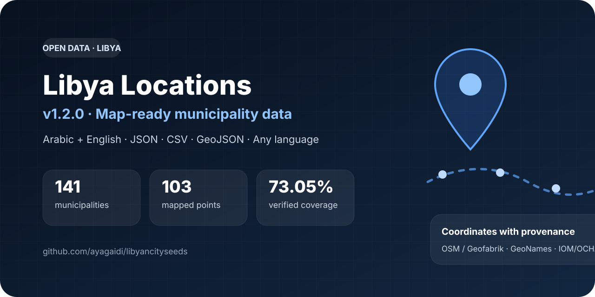

# Libya Locations 🇱🇾

<p align="center">
  
</p>

A **language-agnostic open dataset** of Libyan municipalities and cities with Arabic/English names, stable slugs, JSON, CSV, Laravel seeders, geospatial reference points, GeoJSON, and copy-paste integration examples for common languages.

[](https://github.com/ayagaidi/libyancityseeds/actions/workflows/validate-data.yml)

[العربية](README_AR.md) · [Integration guide](docs/INTEGRATION.md) · [Map data](docs/MAPS.md) · [Data sources](DATA_SOURCES.md) · [Changelog](CHANGELOG.md) · [Contributing](CONTRIBUTING.md)

> **No SDK. No API key. No framework required.** If your language can make an HTTP request and parse JSON, it can use Libya Locations.

## 30-second integration

Use a stable, versioned JSON URL:

```text
https://raw.githubusercontent.com/ayagaidi/libyancityseeds/v1.2.0/data/municipalities.json
```

```js
const locations = await fetch(
  'https://raw.githubusercontent.com/ayagaidi/libyancityseeds/v1.2.0/data/municipalities.json'
).then(response => response.json());
```

The same data contract works in **JavaScript/TypeScript, Python, PHP, Go, Java, C#/.NET, Dart/Flutter, Swift, Ruby, mobile apps, backend services, frontend apps, scripts, and databases**.

See the full **[integration guide](docs/INTEGRATION.md)** and **[copy-paste language examples](examples/README.md)**.

## What's included

| Dataset | Records / coverage | Formats |
| --- | ---: | --- |
| Municipalities | 141 | JSON + CSV + Laravel Seeder |
| Cities | 50 | JSON + CSV + Laravel Seeder |
| Municipality map points | 141 total / 103 mapped | JSON + CSV + GeoJSON |
| Municipality boundaries | 10 matched features | GeoJSON |

The original location record contract remains unchanged:

```json
{
  "id": 94,
  "slug": "tripoli-center",
  "name_ar": "طرابلس المركز",
  "name_en": "Tripoli Center",
  "type": "municipality"
}
```

A machine-readable JSON Schema is provided in [`schemas/location.schema.json`](schemas/location.schema.json).

## Map support in v1.2

`v1.2.0` adds optional geospatial companion datasets **without changing the existing municipality/city record shape**.

Current verified point coverage is **103 of 141 municipalities (73.05%)**. The remaining **38 municipalities intentionally publish `null` coordinates** because the project does not guess locations that cannot be matched confidently. Boundary GeoJSON currently contains **10 matched municipality features**.

Map-point records include `latitude`, `longitude`, `coordinate_source`, `coordinate_source_id`, and `point_type`. Sources are traceable to OpenStreetMap/Geofabrik, GeoNames, or the IOM/OCHA operational hub service.

See [`docs/MAPS.md`](docs/MAPS.md) for coordinate semantics, source attribution, limitations, and the Leaflet example.

## Data files

- [`data/municipalities.json`](data/municipalities.json)
- [`data/municipalities.csv`](data/municipalities.csv)
- [`data/cities.json`](data/cities.json)
- [`data/cities.csv`](data/cities.csv)
- [`data/municipality-points.json`](data/municipality-points.json)
- [`data/municipality-points.csv`](data/municipality-points.csv)
- [`data/municipality-points.geojson`](data/municipality-points.geojson)
- [`data/municipality-boundaries.geojson`](data/municipality-boundaries.geojson)
- [`data/map-coverage.json`](data/map-coverage.json)
- [`data/endpoints.json`](data/endpoints.json) — programmatic discovery of stable dataset and map URLs
- [`data/manifest.json`](data/manifest.json)

## Stable releases vs latest data

For production, pin a release such as `v1.2.0`:

```text
https://raw.githubusercontent.com/ayagaidi/libyancityseeds/v1.2.0/data/cities.json
```

For development or previews, use `master`:

```text
https://raw.githubusercontent.com/ayagaidi/libyancityseeds/master/data/cities.json
```

Version pinning keeps production integrations deterministic while still allowing the dataset to evolve.

## Data source & naming

The Arabic municipality list is compiled from the **Libyan Ministry of Local Government** municipality directory and was checked on **2026-09-07**:

https://www.lgm.gov.ly/municipalities

The English names are **developer-friendly transliterations** intended for application UIs and identifiers; they should not be interpreted as a claim of official English spellings. The city list is the original public dataset from this repository, cleaned and expanded with English names/slugs.

Map reference points and partial boundaries use separately documented public geospatial sources. See [`DATA_SOURCES.md`](DATA_SOURCES.md) and [`docs/MAPS.md`](docs/MAPS.md) for provenance and attribution requirements.

## Laravel

Laravel is supported, but it is optional. Copy the dataset and seeders into your Laravel project, then run:

```bash
php artisan db:seed --class=LibyaMunicipalitySeeder
php artisan db:seed --class=LibyaCitySeeder
```

Expected table columns:

```php
$table->id();
$table->string('slug')->unique();
$table->string('name_ar');
$table->string('name_en');
$table->timestamps();
```

The seeders use `upsert`, so rerunning them is safe for the same slugs.

See:

- [`database/seeders/LibyaMunicipalitySeeder.php`](database/seeders/LibyaMunicipalitySeeder.php)
- [`database/seeders/LibyaCitySeeder.php`](database/seeders/LibyaCitySeeder.php)
- [`examples/laravel-api.php`](examples/laravel-api.php)

## Integration examples

Ready-to-copy examples are available for:

- JavaScript / TypeScript
- Python
- PHP
- Go
- Java
- C# / .NET
- Dart / Flutter
- Swift
- Leaflet / GeoJSON maps

Start at [`examples/README.md`](examples/README.md), or open [`examples/leaflet-map.html`](examples/leaflet-map.html) for the map demo.

## Data quality

Every pull request validates that:

- JSON is valid UTF-8 data;
- IDs and slugs are unique;
- required fields are present;
- record types are correct;
- CSV and JSON contain the same records;
- the manifest counts match the actual datasets;
- integration endpoint metadata matches the release version;
- JSON Schemas match the dataset contracts;
- point coordinates remain inside broad Libya validation bounds;
- point GeoJSON matches the accepted coordinate records;
- map coverage counts and boundary feature counts remain internally consistent;
- the Python example remains syntactically valid.

Run locally:

```bash
python3 scripts/validate_data.py
```

## Contributing

Spelling, transliteration, coordinate, and boundary improvements are welcome when backed by a reliable source. Please do not silently rename a slug that applications may already depend on, and do not submit guessed coordinates just to increase coverage.

Read [`CONTRIBUTING.md`](CONTRIBUTING.md) before submitting a change.

## Project principles

1. **Language-agnostic by default** — JSON/CSV are the primary interface; framework-specific helpers are optional.
2. **Arabic is first-class** — not an afterthought.
3. **Cities and municipalities stay separate** — they are not interchangeable administrative concepts.
4. **Stable slugs matter** — application integrations should not break because display spelling changed.
5. **Sources are documented** — corrections should be reviewable.
6. **Missing is better than guessed** — uncertain map coordinates remain null.
7. **No private data** — this repository only contains public location names and developer tooling.

## Maintainer

**Aya Aljaidi** — Laravel / Full-Stack Developer, Tripoli, Libya  
GitHub: [@ayagaidi](https://github.com/ayagaidi)

## License

Original code in this repository is available under the [MIT License](LICENSE). Source facts and names retain any rights or terms applicable to their original public sources. OpenStreetMap-derived geometry and coordinates require the relevant OSM attribution/ODbL terms; see [`docs/MAPS.md`](docs/MAPS.md).
